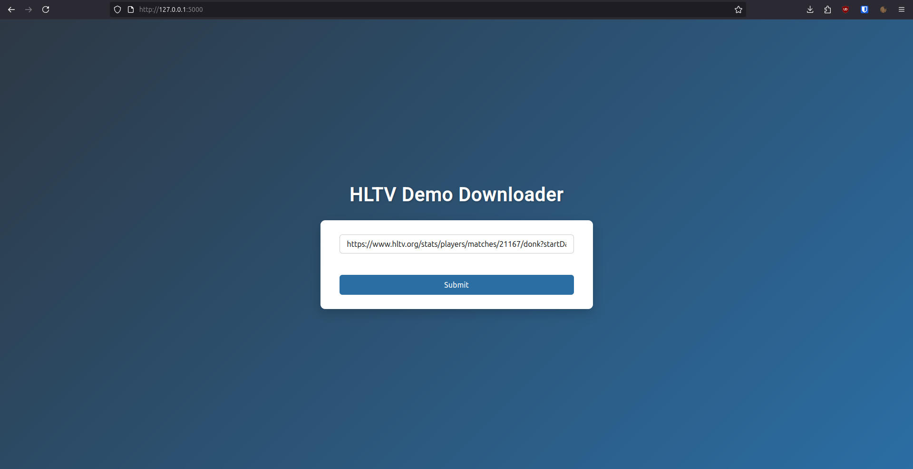
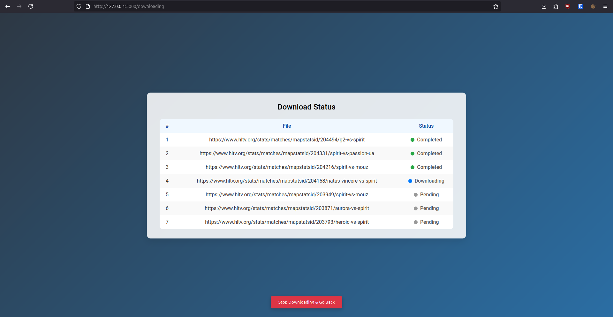
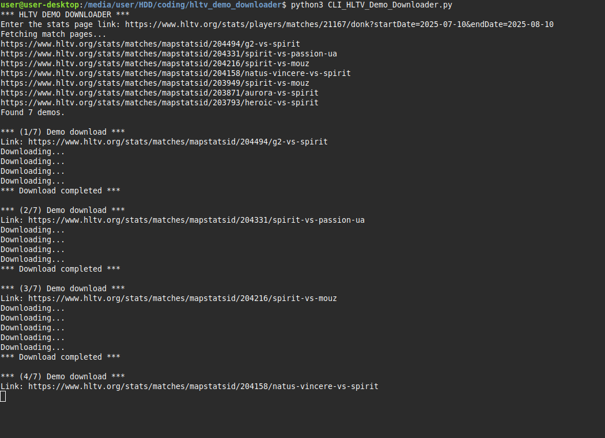

# **HLTV Demo Downloader**
Tool that downloads HLTV demos in bulk.

It only works with pages that have "stats" and "matches" in the url, for example [this player page](https://www.hltv.org/stats/players/matches/11816/ropz) or [this team page](https://www.hltv.org/stats/teams/matches/9565/vitality).

Pages that contain "result" in the url, for example [this team page](https://www.hltv.org/results?team=9565), don't work because there is a Cloudflare captcha blocking the automation.

You can use a user interface ran locally: 





There is also a simple CLI interface:



## Pre-requisites

Install [Firefox](https://www.firefox.com/en-US/thanks/) or any other Firefox fork


Install [Python](https://www.python.org/downloads/)


Use [pip](https://pip.pypa.io/en/stable/) to install needed libraries.
```
pip install -r requirements.txt
```

## Usage
### GUI version:
```
python3 GUI_HLTV_Demo_Downloader.py
```
Open any browser and go to: http://127.0.0.1:5000


### CLI version:
```
python3 CLI_HLTV_Demo_Downloader.py
```
